# PHP Image with Xdebug

## Build the image

```
docker image build -t "php:8-xdebug" .
```

## How to use image with PhpStorm?

### Create a new interpreter

- Under **"Current File"**, click on **"Edit Configuration"**.

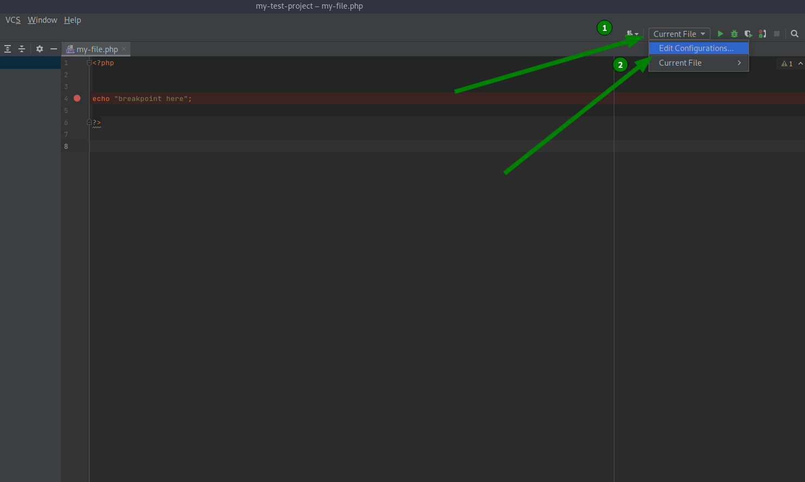

- Click on **"Add new"** and select **"PHP Script"**.

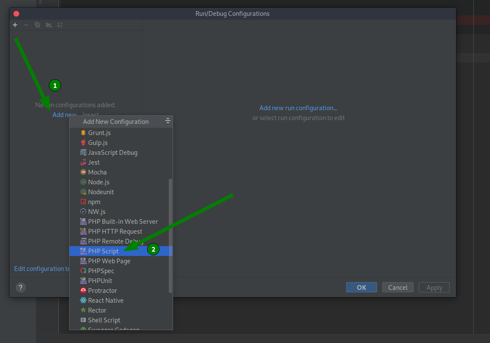

- Choose a **name** (1) for the configuration. At (2) select php **file** you would like to run. Next, at (3), you choose an **interpreter** (which we will configurate in the next steps).

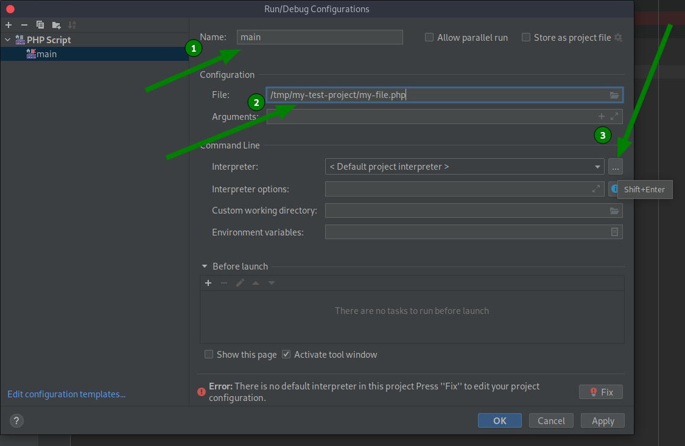

- We will create a *new* interpreter, **from Docker**.

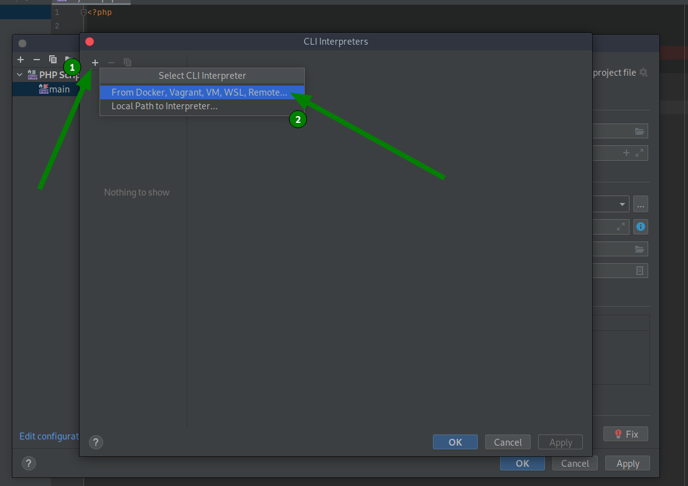

- Select **"Docker"** (1), then at (2) we select (3) **the image you've build**. After this, click on **"OK"** (4).

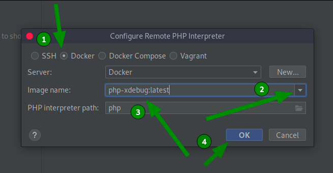

- Verify (1), (2) and (3), click on **"OK"** (4).

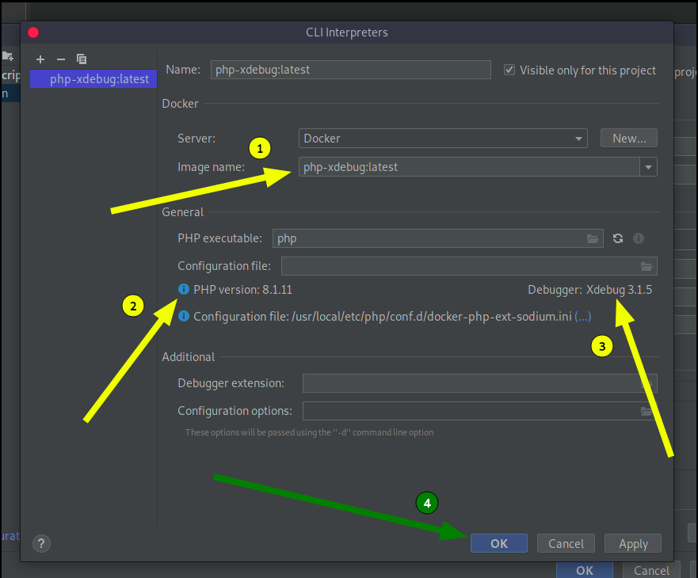

- Now we can select **our created interpreter** (1), click on **"OK"** (2).

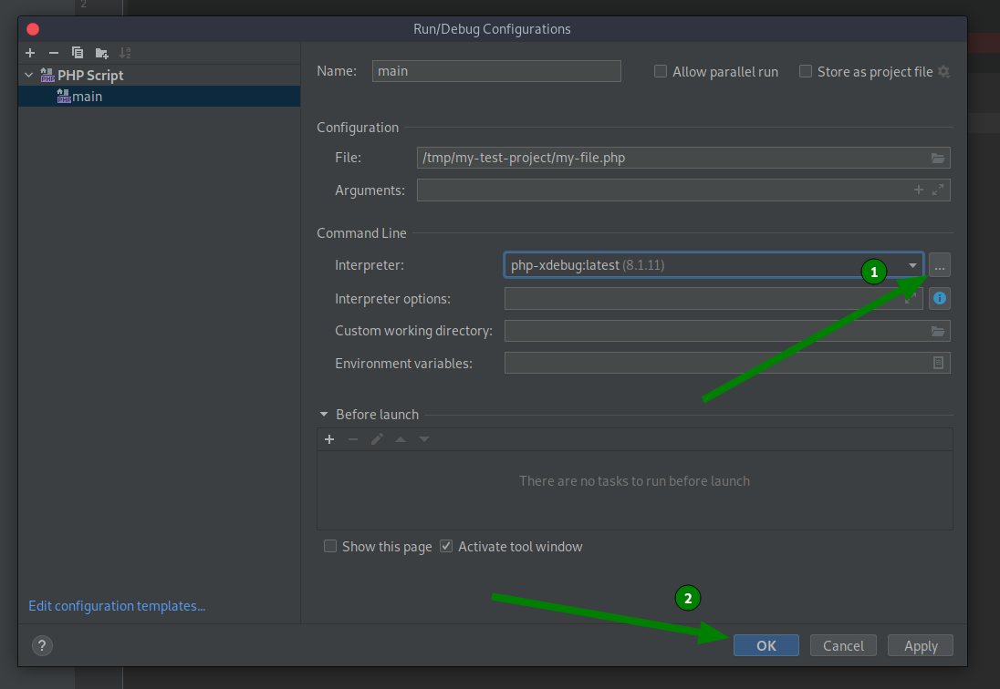

### Update the project properties

- Go to **"File"** (1), and select **"Settings"** (2).

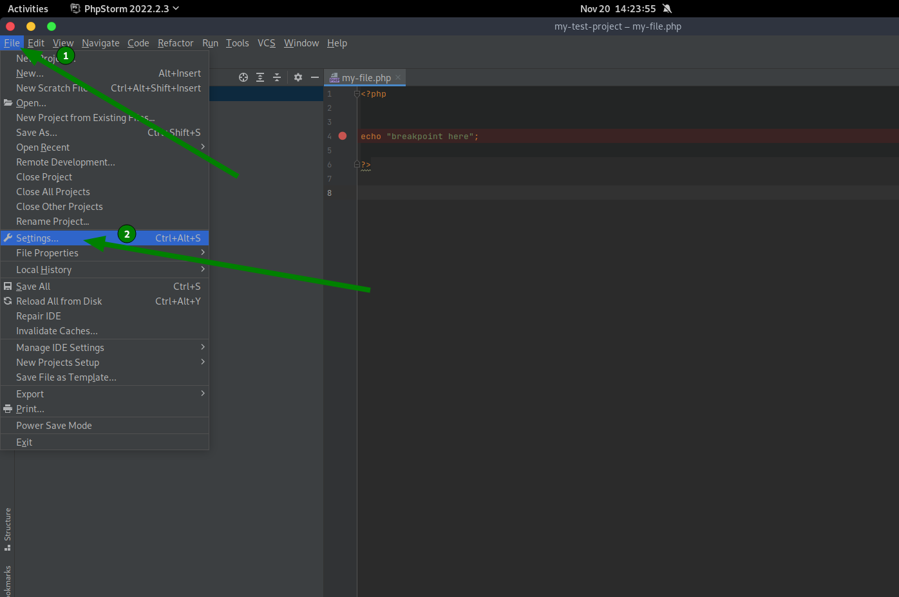

- Go to **"PHP"** (1), set **"8.1"** as PHP language level (2) and **the interpreter you've created** as CLI interpreter, click on **"OK"** (4).

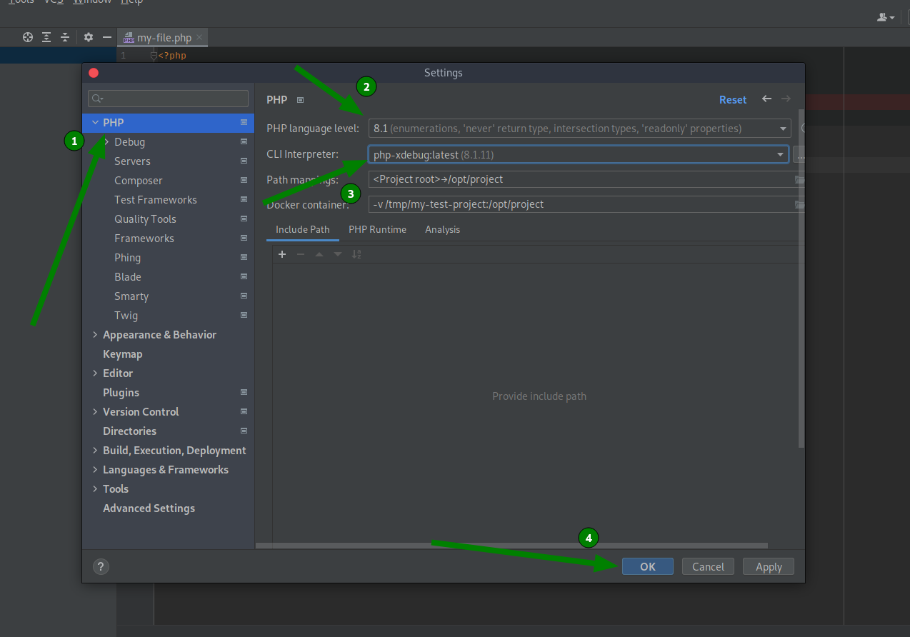

- Click on the *phone* icon (1), it should now look like the picture below. After this we test if our debug setup is working, by clicking on the *bug* icon (2). Do not forget to place a breakpoint in your code to pause the debugger!

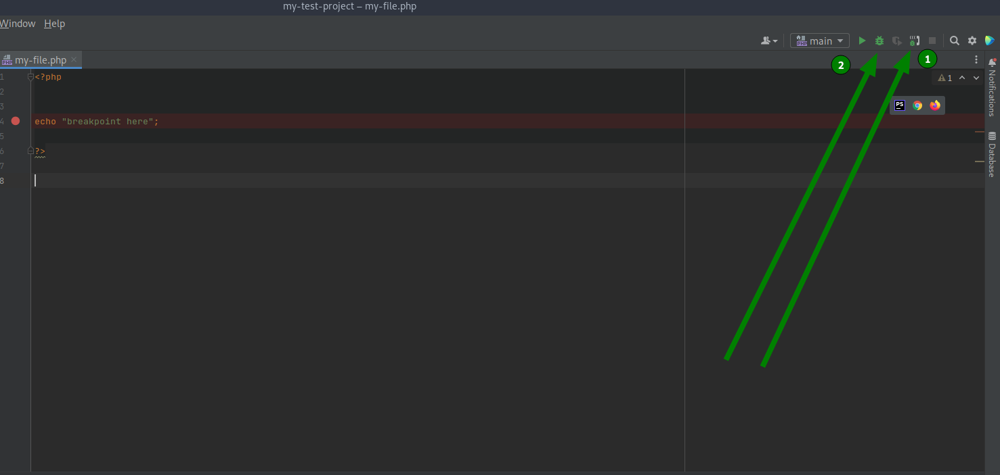

- When your code has reacht a breakpoint the debugger should pop up.

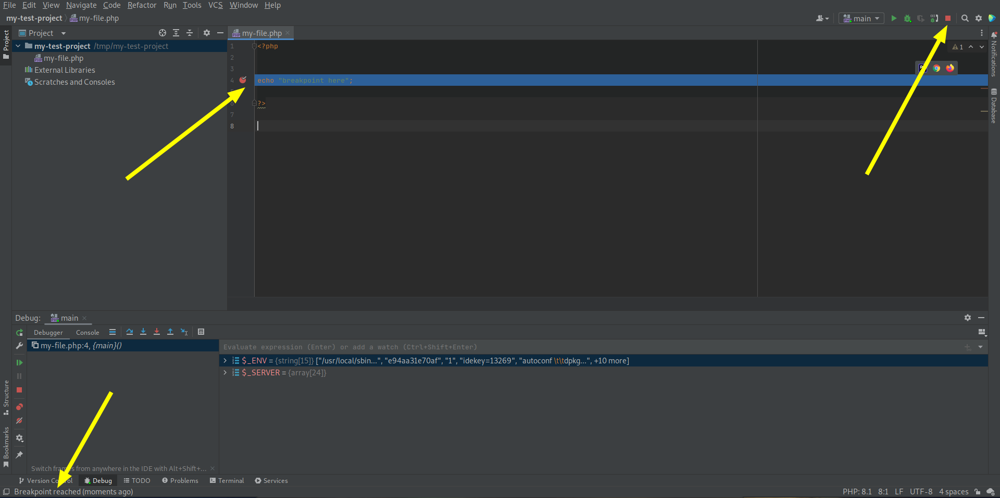
